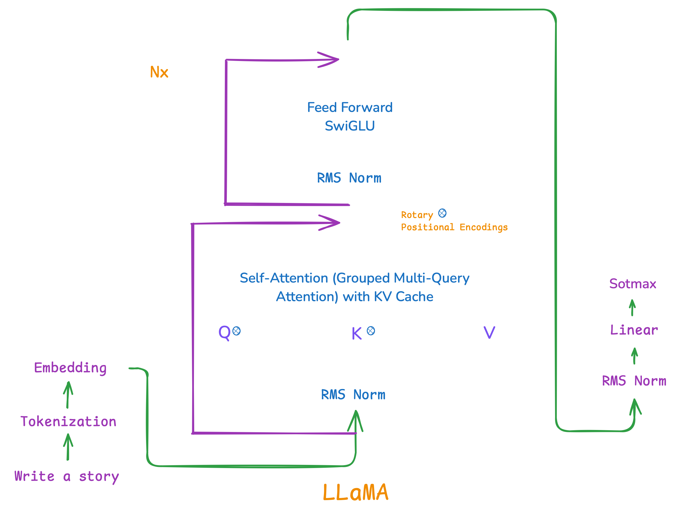
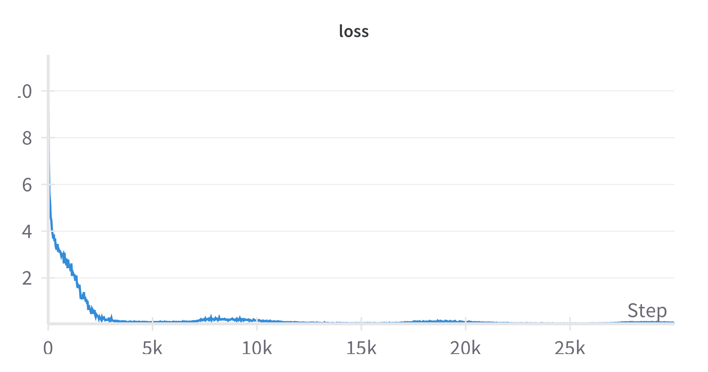
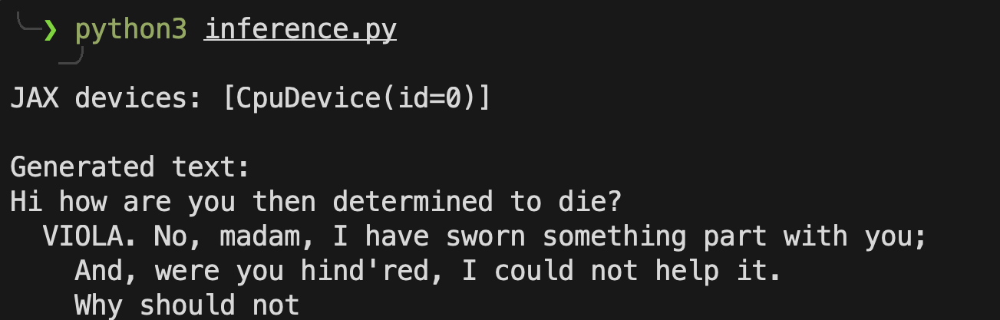

# llama3 in jax 


> [!IMPORTANT]
> this implementation is for educational purposes, which means it is not for any production stuff but it covers all components of the model.
>


### LLaMA3

at its core, LLaMA 3 is a decoder only transformer language model that generates text one token at a time, building on previous tokens to predict what comes next ; like completing a sentence word by word.




#### model 


```python

# Model configuration
class ModelConfig:
    vocab_size = enc.n_vocab  
    dim = 256  
    n_layers = 6  
    n_heads = 8 
    n_kv_heads = 4  
    max_seq_len = 512
    batch_size = 32  
    learning_rate = 3e-4
    dropout_rate = 0.0

config = ModelConfig()

```

### dataset 


```python
# Initialize tokenizer and load data
enc = tiktoken.get_encoding("gpt2")
with open('shakespeare.txt', 'r') as f:
    text = f.read()
tokens = enc.encode(text)
data = jnp.array(tokens)
```

### training 

```python
def train(num_epochs=30, steps_per_epoch=1000):
    key = random.PRNGKey(0)
    params_state = params  # copying
    
    epoch_losses = []
    
    for epoch in range(num_epochs):
        print(f"\nEpoch {epoch + 1}/{num_epochs}")
        print("-" * 50)
        
        epoch_loss = 0.0
        for step in range(steps_per_epoch):
            
            key, batch_key = random.split(key)
            
            # Get batch
            batch = get_batch(batch_key, data, config.batch_size, config.max_seq_len)
            
            # Update model
            params_state, loss = update_step(params_state, batch)
            epoch_loss += loss
            
            
            if step % 100 == 0:
                print(f"epoch {epoch + 1}, step {step}/{steps_per_epoch}: loss = {loss:.4f}")
        
       
        avg_epoch_loss = epoch_loss / steps_per_epoch
        epoch_losses.append(avg_epoch_loss)
        
        print(f"\nepoch {epoch + 1} | average loss: {avg_epoch_loss:.4f}")
        
        
        if (epoch + 1) % 5 == 0:
            save_params(params_state, f'model_checkpoint_epoch_{epoch+1}.pkl')
    
   
    print("Loss by epoch:")
    for epoch, loss in enumerate(epoch_losses, 1):
        print(f"Epoch {epoch}: {loss:.4f}")
    
    # Save final model
    save_params(params_state, 'model_final.pkl')
    return params_state

# Train the model
trained_params = train()
```

### loss 



### output 




### run 

```pytthon 

install jax 
install tiktoken 
install pickle 

```


### Thank you !! 

### You can Support me here :

- [Twitter]()
- [Buy-Me-Coffee]()


### References

- [1] [LLaMA explained by Umar Jmail](https://youtu.be/Mn_9W1nCFLo?si=NpZTLk45re1znY0T)
- [2] [Vision Transformer in pure JAX by Alessio Devoto ](https://alessiodevoto.github.io/ViT-in-pure-JAX/)
- [3] [ROPE by Christopher Fleetwood](https://huggingface.co/blog/designing-positional-encoding)


